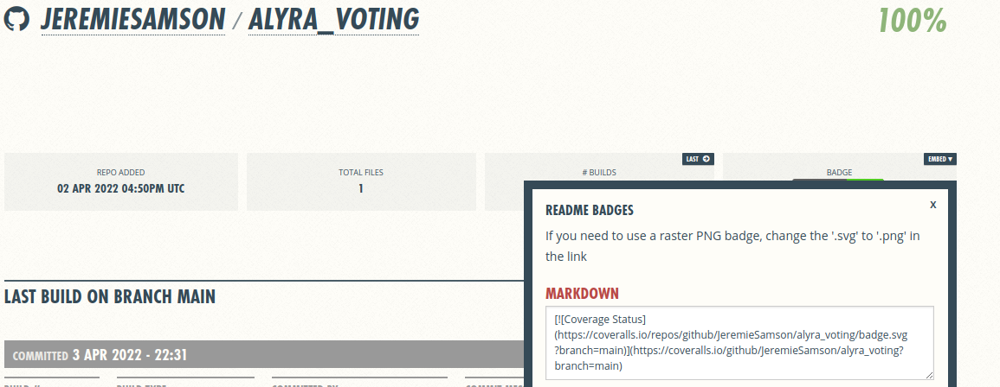
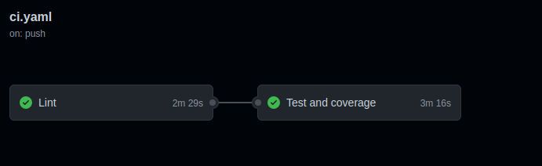

# Solidity template with Docker, CI and Makefile ready to go

This template is here to help you developping solidity localy with docker.

This bootstrap works with truffle and you already have a truffle friendly environment.

You will only have to add your contract in the `contracts` directory and add a migration to deploy your contract on ganache.

Then feel free to add test in the `tests` directory and play with make commands

## Install docker and docker-compose

This template use [Docker](https://www.docker.com/), a container tool to let people have a development environment quickly. There is only 3 dependencies:

- Docker
- docker-compose
- GNU make

### Docker

To install docker, please go to the official docker installation page :
https://docs.docker.com/engine/installation/.

When docker is installed, check it with `docker -v`, you should find something like following:

```
$ docker -v
Docker version 20.10.7, build 20.10.7
```

### Docker-compose

To install docker-compose, you can also find it under docker official documentation :
https://docs.docker.com/compose/install/.

When it's installed, check it with `docker-compose -v`, you should have something like this

```
$ docker-compose -v
docker-compose version 1.25.0
```

### Clone the project

```
git clone git@github.com:JeremieSamson/solidity_docker_bootstrap.git
```

Then you can use make commands

```
// This will build images, up them and install node_modules
make install

// This will launch migration
make truffle migrate

// This will launch tests
make truffle test
```
## Lint

### [ESLint](https://eslint.org/)

ESLint let you find and fix problems in your javascript code.
It is a nice plugin to lint your code.

```
// To see errors
make esnlint

// To fix errors
make esnlintfix
```

### [Sodium/Ethlint](https://github.com/duaraghav8/Ethlint)

Customizable linter for ethereum's solidity smart contract.

```
// To see errors
make solium

// To fix errors
make soliumfix
```

## Coveralls

[Coveralls](https://coveralls.io/) is a web service to help you track your code coverage over time, and ensure that all your new code is fully covered.

### Setup

Your code must be hosted on GitHub, BitBucket, or GitLab.
Then, you only need to login to your coveralls accoutn with github.

### Add a badge

To add your badge, you need to first link a repository to coveralls.
When you are on you repositoru page like `https://coveralls.io/github/ACCOUNT/REPOSITORY_NAME`, just clic on the embed dropdown under the badge card



Then, just copy past the markdown in your readme

```
[](https://coveralls.io/github/JeremieSamson/alyra_voting?branch=main)
```

## Continuous integration

When you have your contract and your tests, you are ready to go to open a pull request on your repository and start pushing your code to your teammates.
The github action workflow installed will

1. Check that your javascript files are properly lints (ESLint)
2. Check that your solidity files are properly lints (Ethlint)
3. Run your tests
4. Run your coverage
5. Push the coverage result to coveralls

